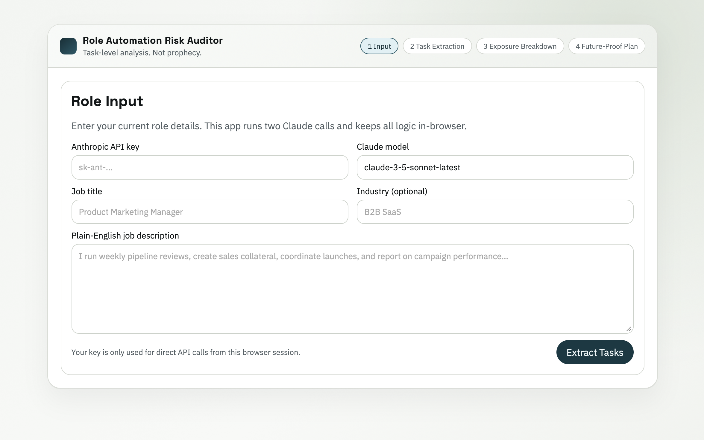

# Role Automation Risk Auditor

Most people only get headlines about AI and jobs. This tool gives a task-level exposure analysis with evidence and a concrete next step.

It takes a job title + plain-English description, then runs two Claude calls:
1. Extract 6-10 concrete tasks with time share.
2. Score each task as high/medium/low exposure, with a one-line WHY, confidence note, and named AI tool already doing it (or "No direct substitute yet").

Output ends with a future-proof plan: one skill to learn, one task to automate first, and one responsibility to double down on.

## Run

```bash
npm run dev
```

Open [http://localhost:4173](http://localhost:4173).

## Screenshot



## Next

V2: industry benchmarking and resume mode.  
V3: team mode for managers with a collective exposure map.
